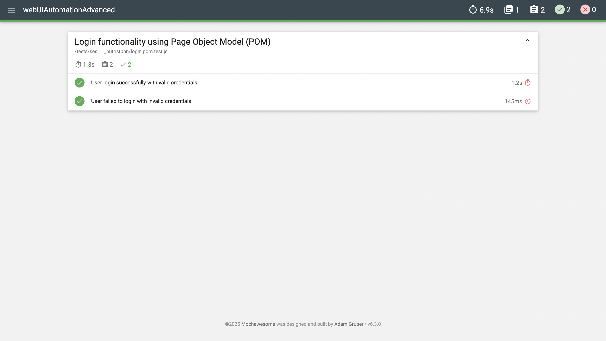
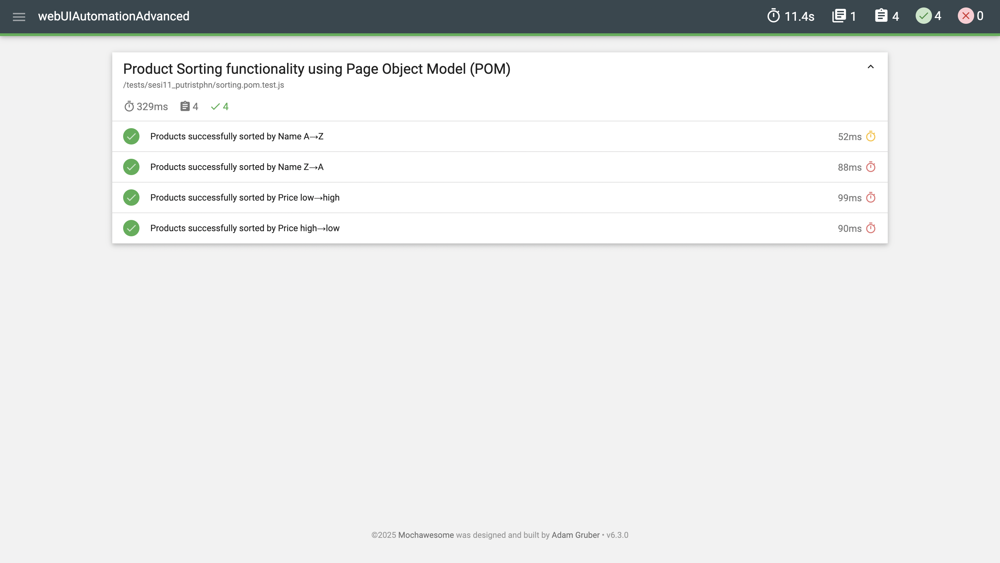

# 🧩 SauceDemo UI Automation Testing — Page Object Model (POM)

An advanced version of the [**webUIAutomation**](https://github.com/putristphn/webUIAutomation) project, refactored using the **Page Object Model (POM)** design pattern to enhance test scalability, readability, and maintainability.  
Developed as part of the **Digital Skola QA Bootcamp Batch 12 - Session 11 (Web UI Automation Advanced)** by **Putri Stephanie Lesilolo**.

---

## 📋 Project Overview

This project automates UI test scenarios for the [**SauceDemo Website**](https://www.saucedemo.com) using:
- ✅ Login flow validation  
- ✅ Product sorting by name and price  
- ✅ Assertions for deterministic sorting results  
- ✅ Page Object Model architecture for reusable and maintainable test structure  
- ✅ Chrome headless execution for CI or remote testing environments  

---

## 🧠 Why POM (Page Object Model)?

| Concept | Description |
|:--------|:-------------|
| **Before (Session 10)** | Test scripts contained all logic — element locators, actions, and assertions in one file. |
| **Now (Session 11)** | Using POM, all page elements and behaviors are moved to dedicated page classes. Tests only call high-level actions, improving code clarity and reuse. |

**✅ Benefits:**
- Easier to maintain and scale
- Reduces code duplication
- Enhances test readability
- Improves debugging and future updates

---

## 📁 Folder Structure
```
webUIAutomationAdvanced/
├── pages/
│ ├── basePage.js                 # Common reusable actions (open, click, type, etc.)
│ ├── loginPage.js.               # Login page locators and methods
│ └── inventoryPage.js.           # Inventory page (sorting logic, assertions)
│
├── tests/
│ ├── sesi11_putristphn/
│     ├── login.pom.test.js.      # Login test cases using POM
│     └── sorting.pom.test.js     # Sorting test cases using POM
│
├── utils/
│ └── driver.js                   # Driver setup and configuration
│
├── mochawesome-report/           # Auto-generated HTML reports
│ ├── assets/
│     └── report_login.png
│     └── report_sorting.png
│
├── package.json                  # Project metadata and test scripts
└── README.md
```

---

## ⚙️ Tech Stack

| Tool | Purpose |
|:------|:---------|
| **JavaScript** | Test scripting language |
| **Selenium WebDriver** | Browser automation framework |
| **Mocha** | Test runner |
| **Mochawesome** | Report generator |
| **Node.js + npm** | Environment and dependency manager |
| **ChromeDriver** | Execution engine for UI tests |

---

## 🚀 How to Run

### 1️⃣ Clone this repository
```bash
git clone https://github.com/putristphn/webUIAutomationAdvanced.git
cd webUIAutomationAdvanced
```
### 2️⃣ Install dependencies
```bash
npm install
```
### 3️⃣ Run tests
```bash
# Run login tests
npm run login:pom

# Run sorting tests
npm run sorting:pom
```
### 4️⃣ View Mochawesome report
After test execution, open the generated HTML report:
```bash
open mochawesome-report/mochawesome.html
```

## 🧩 Example — Login Functionality (POM)
```javascript
 it('User login successfully with valid credentials', async () => {
    await login.open();
    await login.login('standard_user', 'secret_sauce');
    await inventory.assertOnPage();

    const logo = await inventory.text(inventory.sel.appLogo);
    assert.strictEqual(logo, 'Swag Labs', 'Should directed to the Inventory Page after login');
  });
```
✅ Simplified test: no locators or navigation logic inside the test —
everything handled by the LoginPage object.

## 🧩 Example — Product Sorting (POM)
```javascript
 it('Products successfully sorted by Name A→Z', async () => {
    await inventory.sortByValue('az');
    const first = await inventory.firstName();
    assert.strictEqual(first, 'Sauce Labs Backpack', '"Sauce Labs Backpack" should be the first item name when sorted A→Z');
  });
``` 
✅ Clear and concise test steps focusing on actions and assertions only.

---

## 🖼️ Test Report Snapshot (Mochawesome)
| Login Functionality                             | Sorting Functionality                             |
| ---------------------------------------- | -------------------------------------------- |
|  |  |

---

## 🧠 Key Learning Points

- Creating easy-to-maintain automated tests using Page Object Model (POM)
- Keeping page locators and test logic separate for better structure
- Reusing helper methods for login and sorting actions
- Producing clear and visual test reports with Mochawesome
- Writing reliable assertions for dynamic page elements

---

## 👩🏻‍💻 Author

**Putri Stephanie Lesilolo**  
*Quality Assurance Engineer*  
📍 Jakarta, Indonesia  

🔗 [LinkedIn](https://www.linkedin.com/in/putrilesilolo/) | [GitHub](https://github.com/putristphn) 
